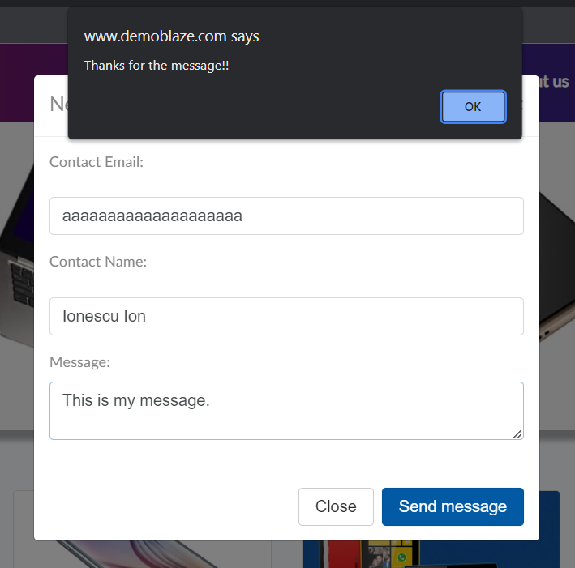
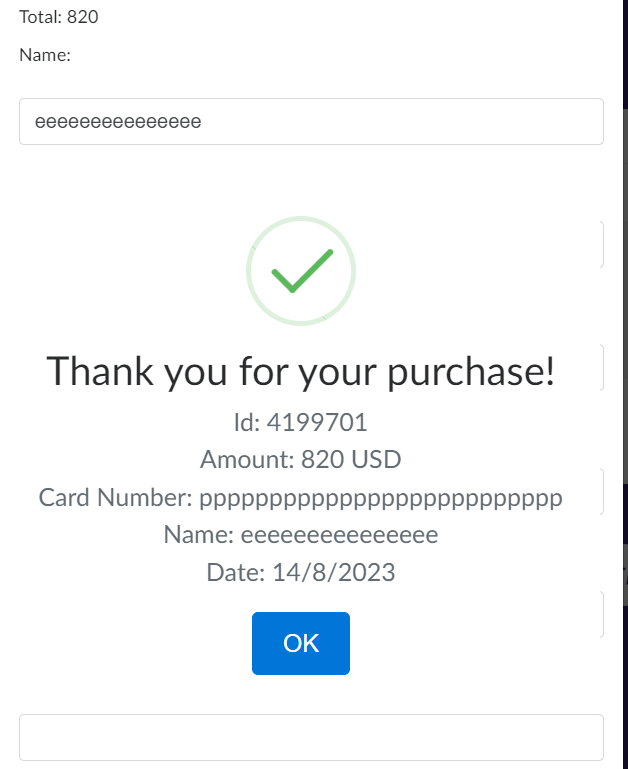
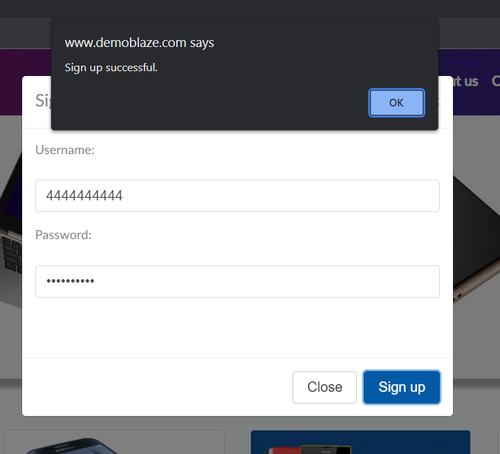

# BugsExample
This document includes writing bug reports.

---------------------------------------------------------------

### Application under test:    *[Product Store](https://www.demoblaze.com/index.html)*   

---------------------------------------------

**Description:**  
[Product section] The user cannot see more pictures of the product.

**Preconditions:**  
Navigate to https://www.demoblaze.com/index.html

**Steps to reproduce:**
1. Click on the Samsung galaxy s6 card
2. Click on the displayed Samsung galaxy s6 image

**Expected result:**  
The image enlarges and more photos of the product can be seen.

**Actual result:**  
Nothing happens when you click on the image.

--------------------------------------------------------------------

**Description:**  
[Product section] The slide with the images representing the product does not work.

**Preconditions:**  
Navigate to https://www.demoblaze.com/index.html

**Steps to reproduce:**
1. Click on the "Nokia lumia 1520"
2. Click on the white underline buttons on the displayed phone image.

**Expected result:**  
Another image of the chosen product will be displayed.

**Actual result:**  
No other image is displayed to the user.

-----------------------------------------------------------------------

**Description:**  
[Contact section] The contact form accepts an invalid email address.

**Preconditions:**  
Navigate to https://www.demoblaze.com/index.html

**Steps to reproduce:**
1. Click on the "Contact" section of the displayed menu
2. Provide an invalid email address
3. Provide a valid "Contact Name"
4. Provide a valid "Message"
5. Click on the button "Send message"

**Expected result:**  
A warning message will be displayed under the "Contact email address" field with the message: "Enter a valid email address"

**Actual result:**  
The form is submitted. A pop-up with the message "Thanks for the message!!" is displayed.

**Attachments:**  

*Notes* **Test data:** Contact Email: aaaaaaaaaaaaaaaaaaaaaaaaa  / Contact Name: Ionescu Ion / Message: This is my message.

--------------------------------------------------------------------------------------------------

**Description:**  
[Cart section] The "Place Order" form accepts an invalid card number.

**Preconditions:**  
Navigate to https://www.demoblaze.com/index.html
Add at least one product to the shopping cart.

**Steps to reproduce:**
1. Click on the "Cart" section of the displayed menu
2. Click on the button "Place Order"
3. Enter only an invalid "Name" and "Credit card", leaving the other fields empty.
4. Click on the "Purchase" button

**Expected result:**  
Warning messages will be displayed under each field.

**Actual result:**  
The form is submitted. A success message is displayed on the screen.

**Attachments:** <be>

*Notes* **Test data:** Name: eeeeeeeeeeeeeee / Credit card: pppppppppppppppppppppppppp

-----------------------------------------------------------------------------------------------------------

**Description:**  
[Sign up section] The user can create an account using an invalid username

**Preconditions:**  
Navigate to https://www.demoblaze.com/index.html

**Steps to reproduce:**
1. Click on the "Sign up" section of the displayed menu
2. Provide an invalid "Username"
3. Provide a valid password
4. Click on "Sign up" button

**Expected result:**  
A warning message will be displayed under the "Username" field.

**Actual result:**  
The account is created. A success message is displayed: "Sign up successful."

**Attachments:** <be>

-----------------------------------------------------------------------------------------------------------

